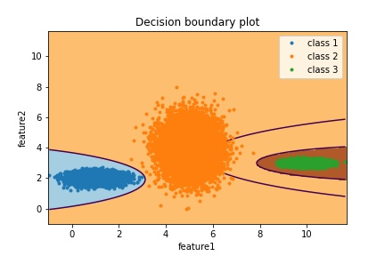

# QuadraticDiscriminantAnalysis

Implementation of Quadratic Discriminant Analysis. 

### Tested on:
1. Toy Dataset - 99 ~ 100% accuracy
2. MNIST Dataset - 85 ~ 88% accuracy

### Decision boundary of toy dataset

The decision boundary is quadratic, thus the name Quadratic Discriminant Analysis.

### Samples generated of MNIST dataset:

The samples generated are more clearer compared to LDA. This is because QDA do not assume same covariance for every class.

### Todo:
1. Add formula used in implementation
